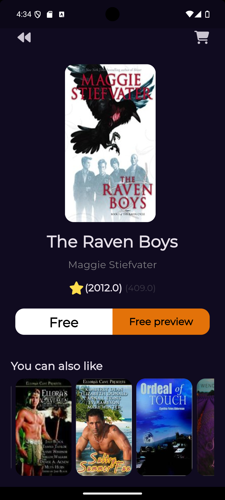

# 📚 Booly App

A beautifully designed **Free Books Explorer** built with Flutter, where you can browse, read, and discover thousands of free books with details about authors and more.

---

## 📱 Screenshots

| Home | Book Details |
|------|-------------|
|  |  |

---

## ✨ Features

- 📖 **Browse Free Books** — Explore a wide library of free books fetched from API
- 🔍 **Book Details** — View full details about each book
- ✍️ **Author Info** — See who wrote the book
- 📲 **Read Online** — Open and read books directly in the app
- 🖼️ **Book Covers** — Beautiful cover images for each book
- ⚡ **Fast & Smooth** — Optimized performance with clean architecture

---

## 🏗️ Architecture

This project follows **Clean Architecture** with **BLoC** pattern for state management.

```
lib/
├── core/
│   ├── di/              # Dependency injection (GetIt)
│   ├── errors/          # Failure handling (Dartz)
│   ├── api/             # API client setup
│   └── utils/
├── features/
│   ├── home/
│   │   ├── data/
│   │   ├── domain/
│   │   └── presentation/
│   └── book_details/
│       ├── data/
│       ├── domain/
│       └── presentation/
└── main.dart
```

---

## 🛠️ Tech Stack

| Category | Technology |
|----------|-----------|
| Framework | Flutter |
| State Management | flutter_bloc |
| API Integration | Dio / HTTP |
| DI | get_it |
| Functional Programming | dartz |
| Image Loading | cached_network_image |

